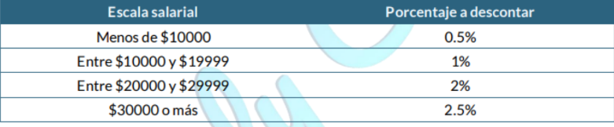

# integrador_LAB2
1 -Enunciado Se requiere un programa que calcule la edad del usuario.

Conceptos aplicados:
Estructura de programación secuencial. Comentarios. Salidas por pantalla. Tipos de datos.
Variables. Operador de asignación. Entrada de datos. Concatenar datos. Caracteres de
escape. Operadores aritméticos. Expresión vs. Instrucción. Pruebas de escritorio.
Conceptos aplicados Estructura de programación secuencial. Comentarios. Salidas por
pantalla. Tipos de datos. Variables. Operador de asignación. Entrada de datos. Concatenar
datos. Caracteres de escape. Operadores aritméticos. Expresión vs. Instrucción. Pruebas
de escritorio. Podés aprender todos estos conceptos y más en esta playlist.

2-Enunciado
Desarrollar un programa que permita ingresar el ancho y el largo de un terreno (en metros)
y el precio del metro cuadrado de tierra. La computadora debe calcular y mostrar el precio
del terreno y la cantidad de metros de alambre que habría que comprar para cercarlo en
tres pasadas.
Ejemplo: Ingresa 20m, 14m y USD1200, debe devolver USD336000 y 204 metros de
alambre.

3- Enunciado
Desarrollar un algoritmo que permita ingresar un monto en dólares (entero). La
computadora debe mostrar cómo pagar ese monto con la menor cantidad de billetes
posibles.
Ejemplo: Si ingresa 147 dólares, debe mostrar:
▪ 1 billete de U$S 100
▪ 0 billetes de US$ 50
▪ 2 billetes de US$ 20
▪ 0 billetes de U$S 10
▪ 1 billete de U$S 5
▪ 1 billete de US$ 2
▪ 0 billetes de U$S 1
Conceptos aplicados
Estructura de programación secuencial. Comentarios. Salidas por pantalla. Tipos de datos.
Variables. Operador de asignación. Entrada de datos. Concatenar datos. Caracteres de
escape.Operadores aritméticos. Expresión vs. Instrucción. Pruebas de escritorio.

4-Enunciado Desarrollar un algoritmo que permita ingresar una hora del día (entre 0 y 23, si
no, informar un error). La computadora debe mostrar a qué momento del día pertenece
según lo siguiente: ▪ Madrugada: Entre 0 y 5, inclusive ▪ Mañana: Entre 6 y 11, inclusive ▪
Mediodía: Entre 12 y 13, inclusive ▪ Tarde: Entre 14 y 19, inclusive ▪ Noche: Entre 20 y 23,
inclusive
Conceptos aplicados
Estructura de programación secuencial. Comentarios. Salidas por pantalla. Tipos de datos.
Variables. Operador de asignación. Entrada de datos. Concatenar datos. Caracteres de
escape. Operadores aritméticos. Expresión vs. Instrucción. Pruebas de escritorio.
Operadores relacionales. Estructuras de programación condicional. IF. IF-ELSE.
Anidamiento de IF-ELSE. ELIF.

5- Enunciado:
Desarrollar un algoritmo que permita ingresar la edad y el sueldo anual en dólares de un
empleado. La computadora debe mostrar el monto del aporte al sindicato que se debe
descontar del salario del empleado, según el siguiente cuadro:

Si la persona tiene 30 años o menos, se sumará un 20% adicional al valor del aporte
sindical. Ejemplos: ▪ Si ingresa 32 años y 8000 dólares, el aporte sería de 40 dólares. ▪ Si
ingresa 25 años y 25.000 dólares, el aporte sería de 600 dólares.
Conceptos aplicados
Estructura de programación secuencial. Comentarios. Salidas por pantalla. Tipos de datos.
Variables. Operador de asignación. Entrada de datos. Concatenar datos. Caracteres de
escape. Operadores aritméticos. Expresión vs. Instrucción. Pruebas de escritorio.
Operadores relacionales. Estructuras de programación condicional. IF. IF-ELSE.
Anidamiento de IF-ELSE. ELIF. Operadores lógicos. Prioridad de operadores
6- Enunciado Desarrollar un algoritmo que permita ingresar dos números enteros y un
símbolo que indique una operación matemática a realizar con ellos:
▪ + para sumar ▪ - para restar ▪ x para multiplicar ▪ / para dividir
La computadora debe mostrar el resultado de la operación.
Conceptos aplicados
Estructura de programación secuencial. Comentarios. Salidas por pantalla. Tipos de datos.
Variables. Operador de asignación. Entrada de datos. Concatenar datos. Caracteres de
escape. Operadores aritméticos. Expresión vs. Instrucción. Pruebas de escritorio.
Operadores relacionales. Estructuras de programación condicional. IF. IF-ELSE.
Anidamiento de IF-ELSE. ELIF. Operadores lógicos. Prioridad de operadores. Estructura de
programación condicional múltiple.

7-Enunciado:
Desarrollar un algoritmo que permita ingresar un número entero positivo. La computadora
debe mostrar la sucesión de números pares desde el número ingresado hasta el cero
(inclusive), en una sola línea: Ejemplo: Si ingresa 15, debe mostrar: 14 12 10 8 6 4 2 0
Conceptos aplicados Estructura de programación secuencial. Comentarios. Salidas por
pantalla. Tipos de datos. Variables. Operador de asignación. Entrada de datos. Concatenar
datos. Caracteres de escape. Operadores aritméticos. Expresión vs. Instrucción. Pruebas
de escritorio. Operadores relacionales. Estructuras de programación condicional. IF.
IF-ELSE. Anidamiento de IF-ELSE. ELIF. Operadores lógicos. Prioridad de operadores.
Estructura de programación condicional múltiple. Estructura de programación de repetición.
WHILE. Ciclos por contador
8-Enunciado Desarrollar un algoritmo que permita ingresar un número entero entre 1 y 10
(inclusive). La computadora debe mostrar la tabla de multiplicar del número ingresado.
Ejemplo: Si ingresa 7, debe mostrar:
7 x 1 = 7
7 x 2 = 14
7 x 3 = 21
7 x 4 = 28
7 x 5 = 35
7 x 6 = 42
7 x 7 = 49
7 x 8 = 56
7 x 9 = 63
7 x 10 = 70
Conceptos aplicados
Estructura de programación secuencial. Comentarios. Salidas por pantalla. Tipos de datos.
Variables. Operador de asignación. Entrada de datos. Concatenar datos. Caracteres de
escape. Operadores aritméticos. Expresión vs. Instrucción. Pruebas de escritorio.
Operadores relacionales. Estructuras de programación condicional. IF. IF-ELSE.
Anidamiento de IF-ELSE. ELIF. Operadores lógicos. Prioridad de operadores. Estructura de
programación condicional múltiple. Estructura de programación de repetición. WHILE. Ciclos
por contador. FOR.
9-Enunciado:Desarrollar un algoritmo que permita ingresar una cantidad de personas. La
computadora debe pedir la edad de cada una y finalmente mostrar el porcentaje de
personas que es mayor de edad.
Conceptos aplicados
Estructura de programación secuencial. Comentarios. Salidas por pantalla. Tipos de datos.
Variables. Operador de asignación. Entrada de datos. Concatenar datos. Caracteres de
escape. Operadores aritméticos. Expresión vs. Instrucción. Pruebas de escritorio.
Operadores relacionales. Estructuras de programación condicional. IF. IF-ELSE.
Anidamiento de IF-ELSE. ELIF. Operadores lógicos. Prioridad de operadores. Estructura de
programación condicional múltiple.. Estructura de programación de repetición. WHILE.
Ciclos por contador. FOR.